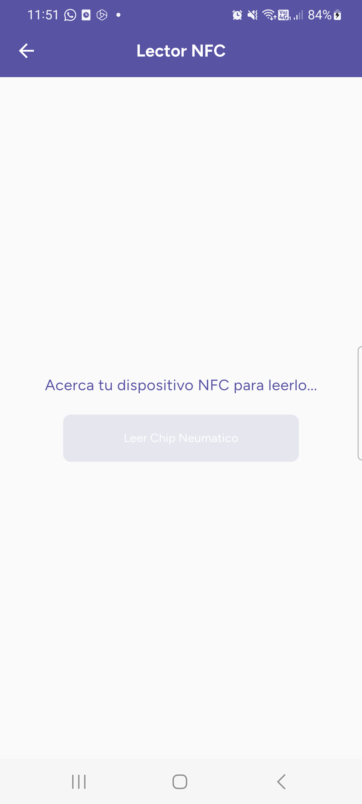

# Aplicación Flutter - Gestión de Neumáticos

## Introducción
Esta aplicación Flutter está diseñada para dispositivos Android y permite la gestión eficiente de neumáticos mediante el uso de chips NFC. Los administradores pueden llevar un registro detallado del historial de cada neumático, registrar kilometraje, tipos de neumáticos y recibir alertas de seguridad.

## Instalación
Sigue estos pasos para configurar y ejecutar la aplicación:

### 1. Requisitos Previos
- Tener **Flutter** instalado en tu sistema. Consulta la [documentación oficial](https://flutter.dev/docs/get-started/install) para la configuración.
- Disponer de un **emulador o un dispositivo Android** conectado para pruebas.

### 2. Clonar el Repositorio
Ejecuta el siguiente comando en la terminal:
```bash
  git clone https://github.com/JavierNancoB/Control-Neumaticos
  cd flutter-app
```

### 3. Instalar Dependencias
Dentro de la carpeta del proyecto, ejecuta:
```bash
  flutter pub get
```

### 4. Ejecutar la Aplicación
Para ejecutar la aplicación en un dispositivo físico o emulador, usa:
```bash
  flutter run
```

---

## Características Principales
- **Escaneo NFC:** Leer y registrar información de neumáticos mediante chips NFC.
- **Registro y consulta de datos:** Kilometraje, tipo de neumático, historial y alertas de seguridad.
- **Autenticación segura:** Inicio de sesión con validación de usuario y almacenamiento seguro.

---

## Estructura del Proyecto

### **Carpetas Principales en `lib/`**
- **`main.dart`**: Punto de entrada de la aplicación.
- **`screens/`**: Contiene las pantallas principales de la aplicación, como login, menú y gestión de neumáticos.
- **`widgets/`**: Componentes reutilizables, como botones y cuadros de diálogo.
- **`services/`**: Manejo de la lógica de negocio, NFC y llamadas a la API.
- **`models/`**: Definición de clases y estructuras de datos, ademas de los temas que utiliza la aplicación.
- **`utils/`**: Funciones de utilidad, como el formateo de fechas.

---

## Dependencias Utilizadas

### **Principales Librerías**
- **`flutter`**: SDK principal.
- **`cupertino_icons`**: Iconos con estilo iOS.
- **`nfc_manager`**: Manejo de NFC.
- **`pin_code_fields`**: Campos de entrada para códigos PIN.
- **`http`**: Realizar peticiones a la API.
- **`shared_preferences`**: Almacenamiento local de datos.
- **`intl`**: Manejo de fechas y formatos.
- **`email_validator`**: Validación de correos electrónicos.
- **`path_provider`**: Acceso a directorios del dispositivo.
- **`permission_handler`**: Manejo de permisos.
- **`open_file`**: Abrir archivos desde la aplicación.
- **`flutter_dotenv`**: Cargar variables de entorno.
- **`flutter_svg`**: Soporte para SVG en Flutter.
- **`flutter_native_splash`**: Configuración de splash screen.
- **`flutter_launcher_icons`**: Generar íconos de la app.
- **`google_fonts`**: Fuentes de Google Fonts.

---

## Descripción de Pantallas [(./screens)](./lib/screens/)
Aquí es donde se generan todas las pantallas que uno vé en la aplicación, posee muy poca lógica de eso se encarga servicios, para los temas se encarga models, ambos se encuentran más abajo. Cabe resaltar que muchas de las caracteristicas que se ven aqui si bien se arman en screens, estan construidas en la carpeta widgets.

### **1. Login**
La pantalla de inicio de sesión permite a los usuarios autenticarse, esta pantalla se crea junto con [splash_screen.dart](./lib/screens/splash/splash_screen.dart), en esta pantalla encontraras todo lo relacionado a la animación de inicio como al formulario de inicio de sesión.

<div style="display: flex; gap: 20px;">
  
  
</div>

#### **Elementos Principales:**
- **[LoginForms](./lib/widgets/login/login_form.dart):** Tiene como objetivo unir todos los widgets relacionados al login, ademas es escencial puesto que es llamado desde el splash para que junto con la animación al momento de la apertura de la aplicación aparezca este widgets en la pantalla posterior a la animación.
- **[UsernameField](./lib/widgets/login/username_field.dart):** Campo de entrada para el usuario.
- **[PasswordField](./lib/widgets/login/password_field.dart):** Campo de entrada de contraseña con opción de ocultar/mostrar.
- **[RememberMeCheckbox](./lib/widgets/login/remember_me_checkbox.dart):** Opción para recordar las credenciales.
- **[ForgotPasswordLink](./lib/widgets/login/forgot_password_link.dart):** Enlace a la pantalla de recuperación de contraseña.
- **[LoginButton](./lib/widgets/login/login_button.dart):** Envío de datos al servicio de autenticación.

#### **Lógica Implementada:**
- **Autocompletar:** Si el usuario seleccionó "Recordarme", se cargan los datos desde el almacenamiento local.
- **Validación:** Se verifica que los campos no estén vacíos.
- **Autenticación:** Conexión con el servicio `AuthService`.
- **Redirección:** Si la autenticación es exitosa, se guarda el token y se redirige al menú principal.

### **2. Menú Principal**
El menú proporciona acceso a las principales funcionalidades:


#### Información Patentes.
Podemos buscar la información de un movil a tarves de su patente, [buscar_movil_screen.dart](./lib/screens/menu/patentes/buscar_movil_screen.dart)


#### Bitacora.
Nos redigirá a la pagina [lector NFC](./lib/screens/nfc/nfc_reader.dart), nos permitirá leer los chips y reedirigirnos a [informacion_neumatica.dart](./lib/screens/menu/bitacora/informacion_neumatico.dart).

<div style="display: flex; gap: 20px;">
  
  
  
</div>

#### Alertas.
Alertas en caso de existir algun tipo de alerta pendiente o leida se mostrara en el menú principal de color amarillo indicando que existen alertas pendientes. La opcion de alertas nos dará 2 opciones:
- **Alertas Pendientes:** Recaen aquí tanto las alertas pendientes como leidas. 
- **Alertas Atendidas:** Por configuración de la API y para mayor facilidad se mostraran solamente las últimas 50 alertas atendidas.

Para mayor información sobre la opción Alertas: [alertas_menu.dart](./lib/screens/menu/alertas/alertas_menu.dart).

<div style="display: flex; gap: 20px;">
  
  
  
  
</div>

#### Stock.
Stock se encarga de mostrarnos todos los neumaticos que esten habilitados y que ademas que su ubicacion sea BODEGA, esto quiere decir que no esten asignados a ningun vehiculo. Para informacion más especifica sobre Stock se encuentra en su archivo: [stock_page.dart](./lib/screens/menu/stock/stock_page.dart).


#### Administración.
Administración nos da la posibilidad de poder elegir entre estas 3 opciones que a su vez tienen un desgloce de más opciones:
- **Movil:** Se puede añadir, deshabilitar como modificar un movil.
- **Neumatico:** Se puede gestionar y deshabilitar un neumatico
- **Usuario:** Esta opcion se podra visibilizar en la apliacion solo para aquellos que posean una cuenta de administrador. Tiene las capacidades de gestionar, modificar, añadir a un usuario y reestablecer su contraseña.

Todas las pantallas de administracion se crean en base a [admin_menu_screen.dart](./lib/screens/menu/admin/admin_menu_screen.dart), para más detalle sobre esta ventana puedes verlo [admin_actions_screen.dart](./lib/screens/menu/admin/admin_actions_screen.dart).

#### Generar Reportes.
Podemos generar un archivo excel con la informacion de usuarios, moviles y neumaticos. Este archivo debe ser filtrado entre 2 fechas. Más información en [generar_reporte_screen.dart](./lib/screens/menu/Reportes/generar_reporte_screen.dart).


#### Reestablecer Contraseña.
La última opcion nos permite reestablecer nuestra contraseña, al momento de hacerlo nos devolveremos al inicio de sesión y tendremos que entrar con nuestras credenciales nuevamente. esta opción es la unica que no se bloquea cuando el administrador reestablece nuestra contraseña, esto con el fin de que lo primero que vea el usaurio al momento de entrar cuando su contraseña sea reestablecida por el administrador sea reestablecer por parte del usuario la contraseña. [reestablecer_passw_page.dart](./lib/screens/menu/admin/usuario/reestablecer_passw_page.dart).


---

## Models [(./models)](./lib/models/) y Services [(./services)](./lib/services/) 
El objetivo de services es recibir y mandar toda la logica a traves de solicitudes a la API. La mayoria de models y services trabajan en conjunto, principalmente es cuando se hace la solicitud a la api y la respuesta de aquella es un .JSON, con el fin de ordenar en variables los datos que nos llega de la solicitud se crean ciertos models. A continuacion se mostraran algunos services y models más importantes:

#### Servicio de autenticacion o [auth_service.dart](./lib/services/auth_service.dart)

#### Modelo de Configuracion de Endpoint o [config.dart](./lib/models/config_ejemplo.dart)

#### Modelo de Temas o [app_colors.dart](./lib/models/temas/app_colors.dart) y [app_themes.dart](./lib/models/temas/app_themes.dart)

---

## Widgets [(./widgets)](./lib/widgets/)
Aquí en su mayoria se encuentra el mayor contenido reutilizable de la aplicación, cosas como el StandarButton que es casi el unico boton perteneciente y diccionario que se utiliza para traducir lo que nos entrega la api para un formato más amigable para el usuario, los revisaremos a continuación:

#### StandarButton [button.dart](./lib/widgets/button.dart)

#### Diccionario [diccionario.dart](./lib/widgets/diccionario.dart)

---

## Utils [./utils/](./lib/utils/)
Por el moemnto solo encontraremos el de snackbar.

#### Snackbar [./snackbar_util.dart](./lib/utils/snackbar_util.dart)

## Contacto
Para consultas o soporte, contactar javiernancob@gmail.com.

